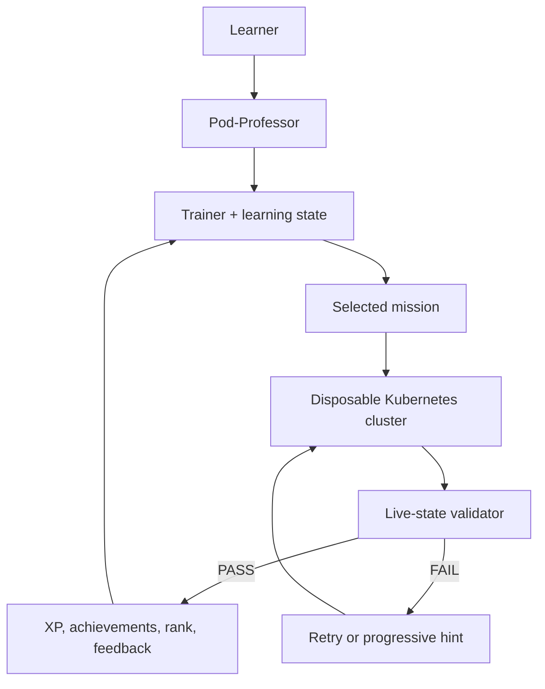

# CKA Lab

> Break Kubernetes on purpose.<br>
> Fix it under pressure.<br>
> Level up until the exam feels boring.

CKA Lab is a practical-first Kubernetes training system. It provisions a small,
disposable kubeadm cluster, injects break/fix missions, validates the live
cluster state, and tracks progress locally. A repo-owned AI tutor called
Pod-Professor can run the loop with you without blurting out the answer.

```text
╔══════════════════════════════════════╗
║          INCIDENT INCOMING           ║
╚══════════════════════════════════════╝

Cluster:    disposable
Mode:       troubleshooting
Hints:      0
Rank:       YAML Goblin
Objective:  fix what broke
```

This is original, exam-style practice. It does not contain leaked or
proprietary exam questions.

## Why practical-first?

Kubernetes knowledge gets useful when you can move from symptom to object to
root cause under time pressure. CKA Lab makes that the default loop:

1. receive a concrete objective;
2. inspect and repair real cluster objects with `kubectl` or YAML;
3. validate the resulting cluster state;
4. request progressively stronger hints only when needed;
5. collect XP and move to the next weak spot.

Theory is still here, but it supports the terminal work instead of replacing
it.

## What makes it different

| Part | What it does |
| --- | --- |
| Disposable factory | Terraform and Ansible build a two-node kubeadm lab on Proxmox. |
| Real validators | Missions pass only when the Kubernetes API shows the required state. |
| Pod-Professor | A practical-first tutor presents missions, reads output, and coaches without immediate spoilers. |
| Adaptive selection | The trainer reads the tracked learning-state contract and prioritizes weak or unstable topics. |
| Local progression | XP, attempts, hints, streaks, ranks, and achievements stay in ignored runtime files. |
| Safe teardown | The factory refuses teardown unless Terraform state and live VM ownership match its exact two-VM boundary. |

## Quick start

The current lab backend is opinionated: you need a Linux workstation, a
Proxmox VE host, a suitable cloud-init template, an isolated bridge, and a
scoped API token before `make lab-up` can work. A random clone is not
zero-configuration.

```bash
git clone https://github.com/ffworker/cka-lab.git
cd cka-lab

# Follow the Proxmox prerequisites and create ignored local configuration.
cp infrastructure/proxmox/terraform.tfvars.example \
  infrastructure/proxmox/terraform.tfvars

# After filling the placeholders and creating the local token file:
make lab-up
make status
```

Install the optional Pod-Professor Hermes profile:

```bash
hermes profile install ./agents/pod-professor/hermes --alias
pod-professor chat
```

Then say: `Start a mission`.

Read [the full quick start](docs/QUICKSTART.md) before provisioning. It lists
the fixed factory assumptions, required tools, secret-file format, and cleanup
behavior.

## A mission in motion

```text
make mission
    ↓
MISSION: Endpoints Were Inside You All Along
    ↓
work with kubectl / YAML
    ↓
make validate ── FAIL ──→ make hint ──→ keep working
    │
   PASS
    ↓
XP + achievements + rank progress + next recommendation
    ↓
make reset
```

The first pack contains eight hands-on missions:

| Mission | Pressure point |
| --- | --- |
| The Replica Trail | Deployment → ReplicaSet → Pods |
| Endpoints Were Inside You All Along | Service selectors and EndpointSlices |
| The Placement–Runtime Divide | scheduler versus kubelet symptoms |
| Two Doors, One Backend | ClusterIP and NodePort repair |
| Release the Kraken, Then Roll It Back | rolling updates and rollback |
| The Dedicated Node | taints and tolerations |
| Configuration Has Left the Container | ConfigMap, Secret, and environment injection |
| Four Pods, No More, No Less | manual scaling and replica convergence |

The catalogue lives in [`scenarios/`](scenarios/).

The trainer hides solutions during normal play; it does not encrypt them. This
is a public repository, so a determined learner can still open a scenario's
`solution.md` directly.

## Pod-Professor

Pod-Professor is the learner-facing tutor. Its behavior, teaching rules, and
Hermes distribution all live under [`agents/pod-professor/`](agents/pod-professor/).

It prefers practical work, reveals two hints in order, waits for an explicit
solution request, and uses trainer-owned progress instead of inventing another
scoreboard. Private Hermes memory and sessions stay in the installed local
profile. The tracked repository learning state remains authoritative.

Pod-Professor consumes `make lab-up`, trainer commands, and kubectl-visible
state. If the Proxmox factory itself breaks, infrastructure repair belongs to a
main infrastructure agent outside the tutor session.

More: [Pod-Professor guide](docs/POD-PROFESSOR.md).

## Disposable Proxmox lab

The implemented backend creates exactly two VMs:

```text
Proxmox VE host
└── cka-factory pool
    ├── cka-cp01      control plane, 2 vCPU, 2 GiB
    └── cka-worker01  worker,        1 vCPU, 2 GiB
```

Terraform clones a pre-existing cloud-init template. Ansible installs
containerd and Kubernetes packages, runs `kubeadm init`, installs pinned
Flannel, joins the worker, and fetches kubeconfig. Runtime credentials,
inventory, state, host keys, kubeconfig, and learner progress are ignored by
Git.

This backend is working, but it is not generic. It currently expects fixed VM
IDs, pool, bridge, SSH alias, and Linux command-line tooling. The template,
datastore, guest addresses, and admin username are local inputs. See
[the factory guide](docs/PROXMOX-FACTORY.md) before adapting it.

## Learner workflow



The machine-readable handoff separates theory-owned fields from practical
feedback. Scenario selection excludes topics marked `notYetIntroduced`, avoids
immediate repetition, and uses simple deterministic priorities rather than a
complex recommendation engine.

More: [architecture](docs/ARCHITECTURE.md) and [training model](docs/TRAINING-MODEL.md).

## Gamification

The rank path is defined in [`trainer/config/ranks.json`](trainer/config/ranks.json):

```text
YAML Goblin → Pod Whisperer → CrashLoop Exorcist → DNS Detective
→ RBAC Sheriff → Scheduler Sorcerer → etcd Necromancer
→ Control Plane Commander
```

Existing achievements reward no-hint completions, first-attempt wins, timely
finishes, reset-and-recovery, study streaks, and ten completed missions. All
progress is local to the user under `.cka-factory/` and is never committed.

More: [gamification rules and thresholds](docs/GAMIFICATION.md).

## Repository map

| Path | Owns |
| --- | --- |
| [`agents/`](agents/) | Pod-Professor behavior and the Hermes profile adapter. |
| [`ansible/`](ansible/) | containerd, kubeadm, CNI, control-plane, and worker bootstrap. |
| [`infrastructure/`](infrastructure/) | Terraform for disposable Proxmox guests. |
| [`scenarios/`](scenarios/) | mission metadata, injection, validation, reset, hints, and solutions. |
| [`trainer/`](trainer/) | mission selection, timers, profile state, XP, ranks, and achievements. |
| [`exercises/`](exercises/) | guided practical drills outside the mission runner. |
| [`qa/`](qa/) | theory, recall, current focus, and theory-owned learner state. |
| [`docs/`](docs/) | public guides plus the internal learning-state handoff. |
| [`scripts/`](scripts/) | safe factory lifecycle and handoff helpers. |

## Requirements

| Layer | Current requirement |
| --- | --- |
| Local machine | Linux, Bash, Python 3, GNU Make, OpenSSH, kubectl, Terraform, and Ansible. |
| Virtualization | Proxmox VE with a cloud-init template, storage, an isolated bridge, and free factory VM IDs. |
| Tutor | Hermes Agent `>=0.21.0` for the shipped Pod-Professor adapter. The CLI trainer works without the tutor. |
| Network | The workstation must reach Proxmox; Proxmox must route the isolated lab network for package installation. |

The repository currently pins Kubernetes `v1.37` and Flannel `v0.28.8` in the
factory-generated inventory. No broader compatibility matrix has been tested.

## Commands

| Command | Result |
| --- | --- |
| `make lab-up` | Provision or reconcile the two-node lab and wait for Ready. |
| `make status` | Show factory, cluster, scenario, and study-state status. |
| `make mission` | Select, inject, and start a mission timer. |
| `make validate` | Check live state and record an attempt. |
| `make hint` | Reveal the next of two hints. |
| `make solution` | Show the solution only when explicitly requested. |
| `make reset` | Restore an active mission or clean a completed one. |
| `make profile` | Show local XP, rank, streaks, achievements, and history. |
| `make lab-down` | Destroy only the exact factory-owned VMs. |

## Project status

| Status | Area |
| --- | --- |
| ✅ Working | Two-node Proxmox factory, kubeadm bootstrap, Flannel, eight missions, live validators, trainer profile, and Pod-Professor Hermes adapter. |
| 🧪 Experimental | Public installation outside the original Proxmox environment; the backend is deliberately opinionated and manually configured. |
| 🧪 Experimental | Selection modes beyond the default loop; they are accepted by the CLI but are not a full mock-exam engine. |
| 🚧 Planned | Broader CKA mission coverage, more troubleshooting scenarios, richer learner analytics, and additional tutor or infrastructure adapters. |

## Contributing

Mission fixes, safer factory behavior, and focused scenario additions are
welcome. Read [CONTRIBUTING.md](CONTRIBUTING.md) before opening a change. Please
report security problems through [SECURITY.md](SECURITY.md), not a public issue.

## License

This repository does not currently include a repository-wide license. Until one
is selected, the contents are visible source but are not licensed for reuse,
redistribution, or modification. Individual files may state their own license.