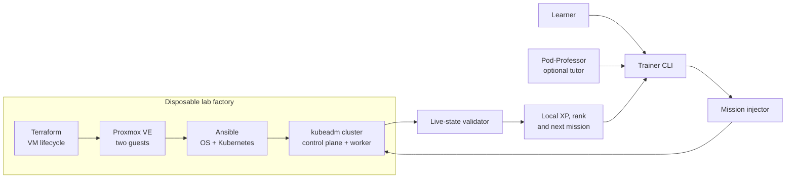

# CKA Lab

> **Break Kubernetes on purpose.**<br>
> **Fix it under pressure.**<br>
> Level up until the exam feels boring.

[](https://github.com/ffworker/cka-lab/actions/workflows/learning-validate.yml)

CKA Lab is a practical-first Kubernetes training system. Terraform and Ansible
build a disposable two-node kubeadm cluster on Proxmox; eight break/fix missions
inject faults, validate the live Kubernetes API, and award local XP. An optional
AI tutor, Pod-Professor, coaches without revealing the answer immediately.

**Kubernetes · Proxmox · Terraform · Ansible · kubeadm · Python · Bash**

> This is an operator-owned lab, not a hosted sandbox. You need a Linux
> workstation, Proxmox VE, a cloud-init template, an isolated bridge, and a
> scoped API token. The current backend is deliberately opinionated.

## Quick start

First complete the [Proxmox setup guide](docs/QUICKSTART.md), including the
cloud-init template, isolated bridge, scoped API token, and ignored local input
files. Then:

```bash
git clone https://github.com/ffworker/cka-lab.git
cd cka-lab
cp infrastructure/proxmox/terraform.tfvars.example \
  infrastructure/proxmox/terraform.tfvars

# Configure the documented Proxmox inputs and local token file first.
make lab-up
make mission
make validate
```

The guide also documents the fixed factory boundaries and safe teardown checks.

Optional tutor:

```bash
hermes profile install ./agents/pod-professor/hermes --alias
pod-professor chat
# Say: Start a mission
```

## The system loop



## What this demonstrates

| Engineering decision | Implementation |
| --- | --- |
| Disposable infrastructure | Terraform owns exactly two factory guests; rebuild and teardown are normal operations. |
| Clear automation boundaries | Terraform owns VM lifecycle. Ansible owns containerd, kubeadm, Flannel, and node configuration. |
| Validation over checklists | Missions pass only when validators observe the required state through Kubernetes. |
| State discipline | The neutral tracked default is the fallback; an ignored `.cka-factory/learner-state.json` drives personalized eligibility when present, while progress stays local. |
| Fail-closed teardown | Destruction is refused unless Terraform state and live Proxmox ownership metadata agree on the exact two-VM boundary. |
| Practical tutor design | Pod-Professor uses the trainer loop, gives progressive hints, and does not own or repair the hypervisor. |
| Testable tooling | GitHub Actions runs the trainer pytest suite and validates tracked JSON and shell syntax on pushes and pull requests. |

## Mission pack

| Mission | Pressure point |
| --- | --- |
| The Replica Trail | Deployment → ReplicaSet → Pods |
| Endpoints Were Inside You All Along | Service selectors and EndpointSlices |
| The Placement–Runtime Divide | Scheduler versus kubelet symptoms |
| Two Doors, One Backend | ClusterIP and NodePort repair |
| Release the Kraken, Then Roll It Back | Rolling updates and rollback |
| The Dedicated Node | Taints and tolerations |
| Configuration Has Left the Container | ConfigMap, Secret, and environment injection |
| Four Pods, No More, No Less | Manual scaling and replica convergence |

Each scenario owns metadata, an injector, a live-state validator, a reset script,
two progressive hints, and an explicit solution. Browse the
[`scenarios/`](scenarios/) catalogue.

## Training commands

| Command | Result |
| --- | --- |
| `make lab-up` | Provision or reconcile the lab and wait for both nodes to become Ready. |
| `make status` | Show factory, cluster, scenario, and local study state. |
| `make mission` | Select and inject a mission, then start its timer. |
| `make validate` | Check live state and record an attempt. |
| `make hint` | Reveal the next of two hints. |
| `make solution` | Show the solution only when explicitly requested. |
| `make reset` | Restore the active mission safely. |
| `make profile` | Show local XP, rank, streaks, achievements, and history. |
| `make lab-down` | Destroy only the exact factory-owned VMs after ownership checks pass. |

## Project status

- **Working:** two-node Proxmox factory, kubeadm bootstrap, Flannel, eight
  missions, live validators, local progression, and the Pod-Professor adapter.
- **Environment-bound:** public installation requires adapting documented local
  inputs around the intentionally fixed safety boundaries.
- **Study mode:** feature development is frozen unless something is broken. The
  project is returning to active CKA practice, not another architecture cycle.
- **Scope:** original exam-style practice only—no leaked or proprietary exam
  questions.

The factory currently pins Kubernetes `v1.37` and Flannel `v0.28.8`. No broader
compatibility matrix has been tested.

## Deeper documentation

- [Quick start](docs/QUICKSTART.md)
- [Architecture and state boundaries](docs/ARCHITECTURE.md)
- [Proxmox factory and teardown safety](docs/PROXMOX-FACTORY.md)
- [Training model](docs/TRAINING-MODEL.md)
- [Gamification](docs/GAMIFICATION.md)
- [Pod-Professor](docs/POD-PROFESSOR.md)
- [Contributing](CONTRIBUTING.md) and [security reporting](SECURITY.md)

## Requirements

The workstation needs Linux, Bash, Python 3, GNU Make, OpenSSH, Git, kubectl,
Terraform, and Ansible. From the repository root, install/check the workstation
tools and create the ignored local configuration templates with the bundled
helper:

```bash
make requirements
make requirements-check
```

The installer creates `infrastructure/proxmox/terraform.tfvars` and
`.cka-factory/proxmox.env` when they do not exist. Edit both files with your
local Proxmox values and token before running `make lab-up`.

The helper supports `apt-get`, `dnf`, `pacman`, and `zypper`. It only installs
local workstation packages. If Terraform or kubectl are not available from the
configured distribution repositories, it prints the official installation link
and exits without guessing at a third-party source. Hermes Agent `>=0.21.0` is
optional and only needed for Pod-Professor; install it separately before the
`hermes profile install` command in the [quick start](docs/QUICKSTART.md).

You still need an operator-managed Proxmox VE lab. The helper does not create
the cloud-init template, isolated bridge, pool, API token, or SSH credentials.

## License

This repository does not currently include a repository-wide license. Until
one is selected, the source is publicly visible but not licensed for reuse,
redistribution, or modification.
