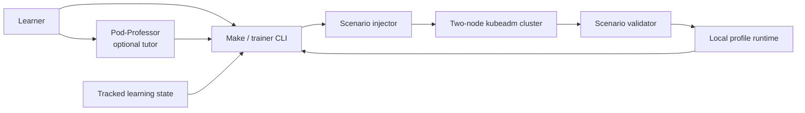
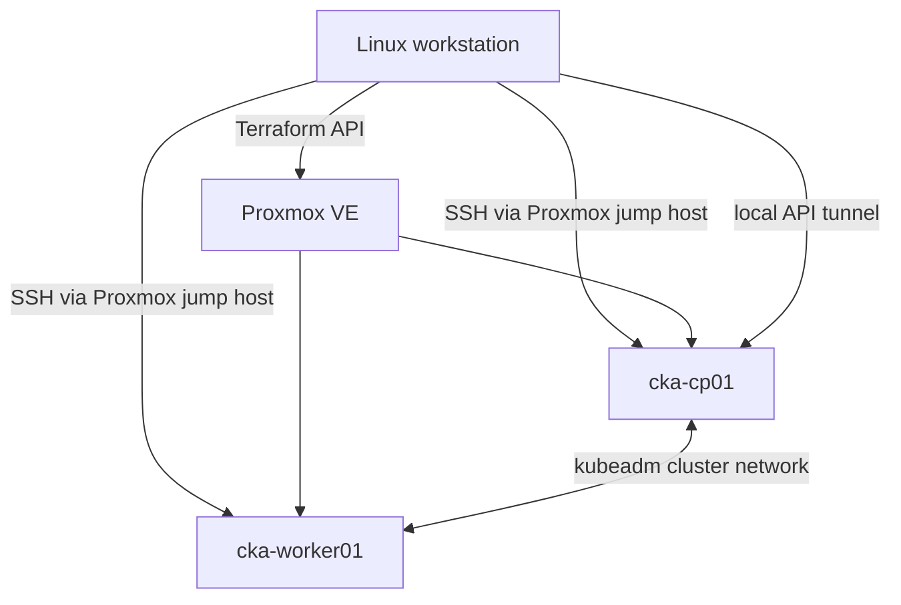

# Architecture

CKA Lab keeps the learner loop, learning state, and disposable infrastructure in one repository while giving each part a narrow owner.

## Components

### Learning state

`docs/cka-shared/handoff.json` is the machine-readable contract. Theory work owns topic classifications and practical readiness. Practical work owns feedback. The trainer reads this state when it selects a mission.

### Trainer

`trainer/` discovers schema-valid scenarios, excludes topics that have not been introduced, avoids immediate repetition, manages active mission state, runs scenario scripts, and updates the local profile after a pass.

### Scenarios

Each directory under `scenarios/` has metadata plus four artifacts: injector, validator, reset script, and hidden solution. Scripts are namespace-scoped except for the taints mission, which owns one exact taint on `cka-worker01`.

### Pod-Professor

`agents/pod-professor/` contains provider-neutral teaching behavior and the current Hermes profile adapter. It calls the trainer and interprets learner output. It does not own Proxmox configuration.

### Factory

Terraform creates the two fixed guests. Ansible installs containerd and Kubernetes, initializes the control plane, installs Flannel, joins the worker, and copies kubeconfig back to the workstation.

## State boundaries

Tracked:

- scenario definitions and validators;
- theory and practical-readiness classifications;
- trainer schemas and game catalogues;
- Terraform and Ansible source.

Ignored and local:

- Proxmox credentials;
- Terraform state and local variables;
- generated Ansible inventory;
- guest host keys and kubeconfig;
- active mission state, XP, streaks, achievements, and history;
- Hermes auth, memory, and sessions.

## Safety model

The factory is intentionally narrow. Terraform may manage only VM IDs `110` and `111` in pool `cka-factory`, with matching names and ownership tags. `lab-down` verifies both local state and live metadata before destroying anything. Scenario reset scripts delete only their owned training namespace; the node-scoped taint scenario checks and removes only its exact owned taint.
