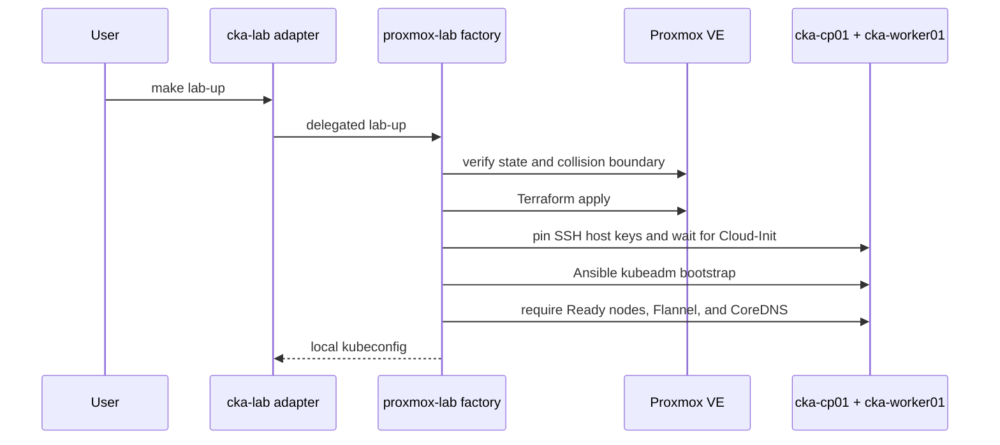

# Proxmox factory

The Proxmox infrastructure implementation is maintained in the public
[`ffworker/proxmox-lab`](https://github.com/ffworker/proxmox-lab) repository and
pinned here as `vendor/proxmox-lab`.

CKA Lab keeps only a narrow compatibility adapter at
`scripts/lab-factory.sh`. The learner-facing commands remain:

```bash
make lab-up
make lab-down
```

Set `PROXMOX_LAB_ROOT` to an absolute local checkout path only when developing
both repositories side by side. Otherwise the adapter uses the pinned submodule.
It accepts no arbitrary scenario path.

## Fixed ownership boundary

The delegated `scenarios/cka-kubernetes-proxmox` factory may manage only:

| Resource | Value |
| --- | --- |
| Pool/tag | `cka-factory` |
| Control plane | VM `320`, `cka-cp01`, 2 vCPU, 2 GiB RAM, 24 GiB disk |
| Worker | VM `321`, `cka-worker01`, 1 vCPU, 2 GiB RAM, 24 GiB disk |
| Reference bridge | `vmbr1` |
| Reference datastore | `local-lvm` |
| CNI | Flannel `v0.28.8` |
| Kubernetes | `v1.37` |
| Workstation jump-host alias | `proxmox` |

The template, datastore, Proxmox node, addresses, administrator name, and SSH
public key are local inputs. IDs, names, pool, and tags are enforced together so
teardown can fail closed.

## Local files

Initialize the dependency and create templates:

```bash
git submodule update --init --recursive
make requirements
```

The helper creates ignored files at:

```text
vendor/proxmox-lab/scenarios/cka-kubernetes-proxmox/terraform/terraform.tfvars
.cka-factory/proxmox.env
```

The token file must be owned by the current user, must not be a symlink, must
have mode `0600`, and must contain exactly one expected assignment. Never commit
it, Terraform state, generated inventory, kubeconfig, or private SSH keys.

## Provisioning sequence



## Teardown guarantees

`make lab-down` proceeds only when:

- Terraform state contains exactly the two expected VM resources;
- state binds them to IDs 320 and 321 with expected names and pool;
- live Proxmox metadata has matching names, pool, and ownership tag.

An empty state is not permission to delete matching IDs. If either reserved ID
exists untracked, the factory refuses to continue.

## Infrastructure changes

Change Terraform, Ansible, Cloud-Init, ownership checks, or teardown behavior in
`proxmox-lab`, then update the pinned submodule commit here. Keep missions,
trainer behavior, and learner state in `cka-lab`.
