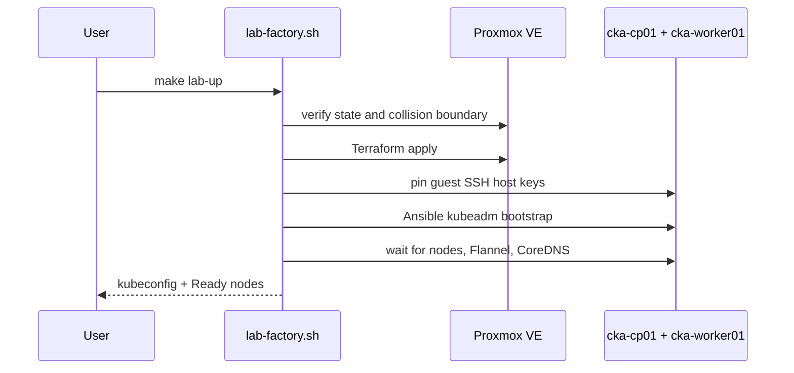

# Proxmox factory

The current infrastructure backend is a working but opinionated two-node Proxmox VE factory. It is safe because its ownership boundary is fixed and checked, not because it can discover arbitrary infrastructure.

## Fixed shape

| Resource | Current value |
| --- | --- |
| Pool | `cka-factory` |
| Template VM ID | Configurable; the example uses `9000` |
| Control plane | VM `110`, `cka-cp01`, 2 vCPU, 2 GiB RAM, 24 GiB disk |
| Worker | VM `111`, `cka-worker01`, 1 vCPU, 2 GiB RAM, 24 GiB disk |
| Bridge | `vmbr1` |
| Datastore | `local-lvm` in the example |
| CNI | Flannel `v0.28.8` |
| Kubernetes | `v1.37` in generated inventory |
| Workstation jump-host alias | `proxmox` |

Destination VM IDs, pool, bridge, names, and tags are enforced in the current
code. The template, datastore, Proxmox node, addresses, and guest admin username
come from ignored local variables. Adapting enforced values is an infrastructure
change and requires updating all safety checks together.

## Required Proxmox preparation

The repository does not create the base template, pool, API identity, ACLs, bridge, or routing. Prepare those before the first run.

The cloud-init template must:

- boot on the target Proxmox node;
- have QEMU guest agent support;
- accept an injected SSH public key;
- provide the configured admin user with passwordless sudo;
- reach package repositories and DNS from `vmbr1`.

Create a scoped token named `cka-factory@pve!terraform`. It needs only the
permissions required to clone the configured template, use the selected storage
and bridge, read guest-agent output, and manage factory guests in pool
`cka-factory`. Keep ACL setup operator-managed and review it against your
Proxmox version.

## Local files

Copy and edit:

```bash
cp infrastructure/proxmox/terraform.tfvars.example \
  infrastructure/proxmox/terraform.tfvars
```

Create `.cka-factory/proxmox.env` with mode `0600`:

```text
TF_VAR_proxmox_api_token=cka-factory@pve!terraform=REPLACE_WITH_TOKEN_SECRET
```

Both paths are ignored. The lifecycle script rejects a symlinked, non-owner, or incorrectly permissioned token file and parses only the expected assignment.

## Provisioning sequence



## Teardown guarantees

`make lab-down` destroys only when:

- Terraform state contains exactly the two expected VM resources;
- state binds them to IDs `110` and `111` with the expected names and pool;
- live Proxmox metadata has matching names, pool, and factory tag.

An empty state is not permission to delete matching IDs. If either ID exists untracked, teardown refuses to continue.

## Current limits

- Linux/GNU userland is required by the lifecycle script.
- Proxmox is the only infrastructure backend.
- Template and ACL bootstrapping are manual.
- The topology is one control-plane node and one worker, not HA.
- No compatibility matrix beyond the current pinned versions has been tested.
